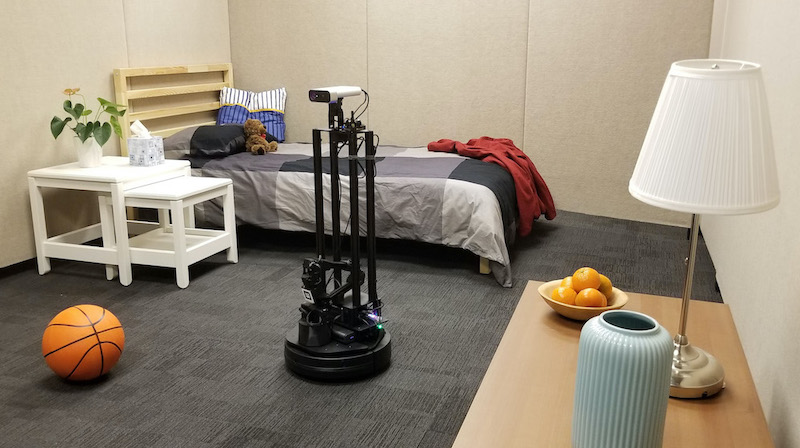

# AllenAct Tutorials

We provide several tutorials to help ramp up researchers to the field of Embodied-AI as well as to the AllenAct framework.

## [Navigation in MiniGrid](../tutorials/minigrid-tutorial.md)

We train an agent to complete the `MiniGrid-Empty-Random-5x5-v0` task within the [MiniGrid](https://github.com/maximecb/gym-minigrid) environment. 

This tutorial presents:

* Writing an experiment configuration file with a simple training pipeline from scratch.
* Using one of the supported environments with minimal user effort.
* Training, validation and testing your experiment from the command line.

[Follow the tutorial here.](../tutorials/minigrid-tutorial.md)

## [PointNav in RoboTHOR](../tutorials/training-a-pointnav-model.md)

We train an agent on the Point Navigation task within the RoboTHOR Embodied-AI environment.

This tutorial presents:

* The basics of the Point Navigation task, a common task in Embodied AI
* Using an external dataset
* Writing an experiment configuration file with a simple training pipeline from scratch.
* Use one of the supported environments with minimal user effort.
* Train, validate and test your experiment from the command line.
* Testing a pre-trained model

[Follow the tutorial here.](../tutorials/training-a-pointnav-model.md)

## [Swapping in a new environment](../tutorials/transfering-to-a-different-environment-framework.md)

This tutorial demonstrates how easy it is modify the experiment config created in the RoboTHOR PointNav tutorial to work with the iTHOR and Habitat environments. 

[Follow the tutorial here.](../tutorials/transfering-to-a-different-environment-framework.md)

