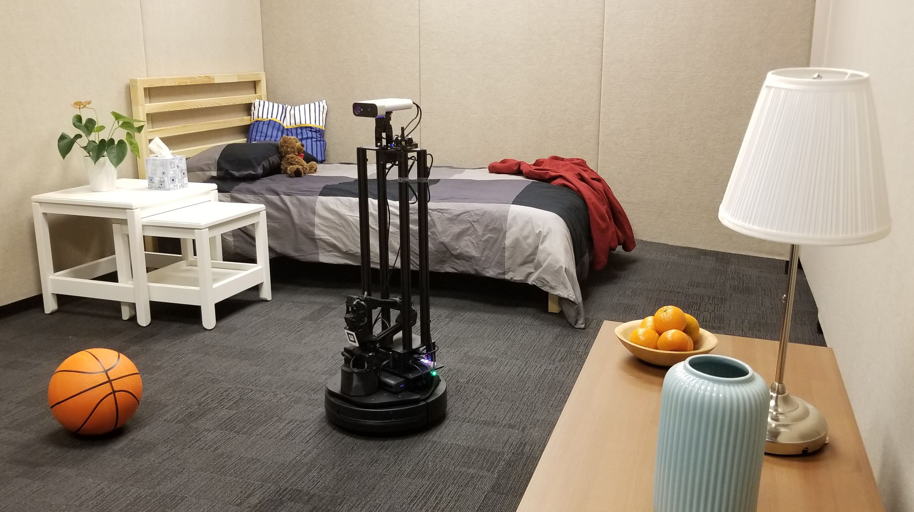
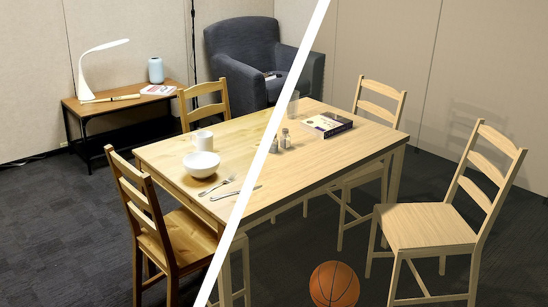
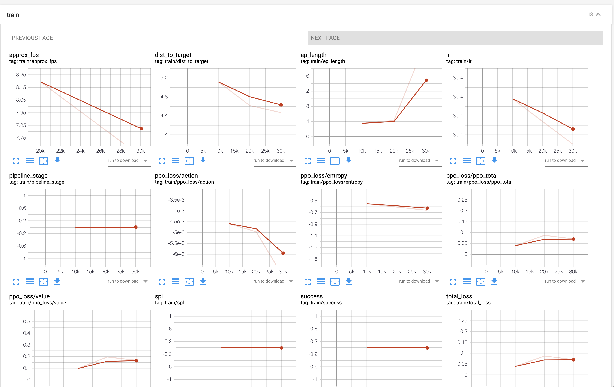

<!-- DO NOT EDIT THIS FILE. --> 
<!-- THIS FILE WAS AUTOGENERATED FROM 'ALLENACT_BASE_DIR/projects/tutorials/training_a_pointnav_model.py', EDIT IT INSTEAD. -->

# Tutorial: PointNav in RoboTHOR.

## Introduction
One of the most obvious tasks that an embodied agent should master is navigating the world it inhabits.
Before we can teach a robot to cook or clean it first needs to be able to move around. The simplest
way to formulate "moving around" into a task is by making your agent find a beacon somewhere in the environment.
This beacon transmits its location, such that at any time, the agent can get the direction and euclidian distance
to the beacon. This particular task is often called Point Navigation, or **PointNav** for short.

#### PointNav
At first glance, this task seems trivial. If the agent is given the direction and distance of the target at
all times, can it not simply follow this signal directly? The answer is no, because agents are often trained
on this task in environments that emulate real-world buildings which are not wide-open spaces, but rather
contain many smaller rooms. Because of this, the agent has to learn to navigate human spaces and use doors
and hallways to efficiently navigate from one side of the building to the other. This task becomes particularly
difficult when the agent is tested in an environment that it is not trained in. If the agent does not know
how the floor plan of an environment looks, it has to learn to predict the design of man-made structures,
to efficiently navigate across them, much like how people instinctively know how to move around a building
they have never seen before based on their experience navigating similar buildings.

#### What is an environment anyways?
Environments are worlds in which embodied agents exist. If our embodied agent is simply a neural network that is being
trained in a simulator, then that simulator is its environment. Similarly, if our agent is a
physical robot then its environment is the real world. The agent interacts with the environment by taking one
of several available actions (such as "move forward", or "turn left"). After each action, the environment
produces a new frame that the agent can analyze to determine its next step. For many tasks, including PointNav
the agent also has a special "stop" action which indicates that the agent thinks it has reached the target.
After this action is called the agent will be reset to a new location, regardless if it reached the
target. The hope is that after enough training the agent will learn to correctly assess that it has successfully
navigated to the target.



There are many simulators designed for the training
of embodied agents. In this tutorial, we will be using a simulator called [RoboTHOR](https://ai2thor.allenai.org/robothor/),
which is designed specifically to train models that can easily be transferred to a real robot, by providing a
photo-realistic virtual environment and a real-world replica of the environment that researchers can have access to.
RoboTHOR contains 60 different virtual scenes with different floor plans and furniture and 15 validation scenes.

It is also important to mention that **AllenAct**
has a class abstraction called Environment. This is not the actual simulator game engine or robotics controller,
but rather a shallow wrapper that provides a uniform interface to the actual environment.

#### Learning algorithm
Finally, let us briefly touch on the algorithm that we will use to train our embodied agent to navigate. While
*AllenAct* offers us great flexibility to train models using complex pipelines, we will be using a simple
pure reinforcement learning approach for this tutorial. More specifically, we will be using DD-PPO,
a decentralized and distributed variant of the ubiquitous PPO algorithm. For those unfamiliar with Reinforcement
Learning we highly recommend [this tutorial](http://karpathy.github.io/2016/05/31/rl/) by Andrej Karpathy, and [this
book](http://www.incompleteideas.net/book/the-book-2nd.html) by Sutton and Barto. Essentially what we are doing
is letting our agent explore the environment on its own, rewarding it for taking actions that bring it closer
to its goal and penalizing it for actions that take it away from its goal. We then optimize the agent's model
to maximize this reward.

## Requirements
To train the model on the PointNav task, we need to [install the RoboTHOR environment](../installation/installation-framework.md)
and [download the RoboTHOR PointNav dataset](../installation/download-datasets.md)

The dataset contains a list of episodes with thousands of randomly generated starting positions and target locations for each of the scenes
as well as a precomputed cache of distances, containing the shortest path from each point in a scene, to every other point in that scene.
This is used to reward the agent for moving closer to the target in terms of geodesic distance - the actual path distance (as opposed to a
straight line distance).

## Config File Setup
Now comes the most important part of the tutorial, we are going to write an experiment config file.
If this is your first experience with experiment config files in AllenAct, we suggest that you
first see our how-to on [defining an experiment](../howtos/defining-an-experiment.md) which will
walk you through creating a simplified experiment config file.

Unlike a library that can be imported into python, **AllenAct** is structured as a framework with a runner script called
`main.py` which will run the experiment specified in a config file. This design forces us to keep meticulous records of
exactly which settings were used to produce a particular result,
which can be very useful given how expensive RL models are to train.

The `projects/` directory is home to different projects using `AllenAct`. Currently it is populated with baselines
of popular tasks and tutorials.

We already have all the code for this tutorial stored in `projects/tutorials/training_a_pointnav_model.py`. We will
be using this file to run our experiments, but you can create a new directory in `projects/` and start writing your
experiment there.

We start off by importing everything we will need:

```python
import glob
import os
from math import ceil
from typing import Dict, Any, List, Optional, Sequence

import gym
import numpy as np
import torch
import torch.nn as nn
import torch.optim as optim
from torch.optim.lr_scheduler import LambdaLR
from torchvision import models

from allenact.algorithms.onpolicy_sync.losses import PPO
from allenact.algorithms.onpolicy_sync.losses.ppo import PPOConfig
from allenact.base_abstractions.experiment_config import ExperimentConfig, MachineParams
from allenact.base_abstractions.preprocessor import SensorPreprocessorGraph
from allenact.base_abstractions.sensor import SensorSuite
from allenact.base_abstractions.task import TaskSampler
from allenact.embodiedai.preprocessors.resnet import ResNetPreprocessor
from allenact.utils.experiment_utils import (
    Builder,
    PipelineStage,
    TrainingPipeline,
    LinearDecay,
    evenly_distribute_count_into_bins,
)
from allenact_plugins.ithor_plugin.ithor_sensors import RGBSensorThor
from allenact_plugins.robothor_plugin.robothor_sensors import GPSCompassSensorRoboThor
from allenact_plugins.robothor_plugin.robothor_task_samplers import (
    PointNavDatasetTaskSampler,
)
from allenact_plugins.robothor_plugin.robothor_tasks import PointNavTask
from projects.pointnav_baselines.models.point_nav_models import (
    ResnetTensorPointNavActorCritic,
)
```
Next we define a new experiment config class:
```python
class PointNavRoboThorRGBPPOExperimentConfig(ExperimentConfig):
    """A Point Navigation experiment configuration in RoboThor."""
```
We then define the task parameters. For PointNav, these include the maximum number of steps our agent
can take before being reset (this prevents the agent from wandering on forever), and a configuration
for the reward function that we will be using.

```python
    # Task Parameters
    MAX_STEPS = 500
    REWARD_CONFIG = {
        "step_penalty": -0.01,
        "goal_success_reward": 10.0,
        "failed_stop_reward": 0.0,
        "shaping_weight": 1.0,
    }
```
In this case, we set the maximum number of steps to 500.
We give the agent a reward of -0.01 for each action that it takes (this is to encourage it to reach the goal
in as few actions as possible), and a reward of 10.0 if the agent manages to successfully reach its destination.
If the agent selects the `stop` action without reaching the target we do not punish it (although this is
sometimes useful for preventing the agent from stopping prematurely). Finally, our agent gets rewarded if it moves
closer to the target and gets punished if it moves further away. `shaping_weight` controls how strong this signal should
be and is here set to 1.0. These parameters work well for training an agent on PointNav, but feel free to play around
with them.

Next, we set the parameters of the simulator itself. Here we select a resolution at which the engine will render
every frame (640 by 480) and a resolution at which the image will be fed into the neural network (here it is set
to a 224 by 224 box).

```python
    # Simulator Parameters
    CAMERA_WIDTH = 640
    CAMERA_HEIGHT = 480
    SCREEN_SIZE = 224
```
Next, we set the hardware parameters for the training engine. `NUM_PROCESSES` sets the total number of parallel
processes that will be used to train the model. In general, more processes result in faster training,
but since each process is a unique instance of the environment in which we are training they can take up a
lot of memory. Depending on the size of the model, the environment, and the hardware we are using, we may
need to adjust this number, but for a setup with 8 GTX Titans, 60 processes work fine. 60 also happens to
be the number of training scenes in RoboTHOR, which allows each process to load only a single scene into
memory, saving time and space.

`TRAINING_GPUS` takes the ids of the GPUS on which
the model should be trained. Similarly `VALIDATION_GPUS` and `TESTING_GPUS` hold the ids of the GPUS on which
the validation and testing will occur. During training, a validation process is constantly running and evaluating
the current model, to show the progress on the validation set, so reserving a GPU for validation can be a good idea.
If our hardware setup does not include a GPU, these fields can be set to empty lists, as the codebase will default
to running everything on the CPU with only 1 process.

```python
    ADVANCE_SCENE_ROLLOUT_PERIOD: Optional[int] = None
    NUM_PROCESSES = 20
    TRAINING_GPUS: Sequence[int] = [0]
    VALIDATION_GPUS: Sequence[int] = [0]
    TESTING_GPUS: Sequence[int] = [0]
```
Since we are using a dataset to train our model we need to define the path to where we have stored it. If we
download the dataset instructed above we can define the path as follows

```python
    TRAIN_DATASET_DIR = os.path.join(os.getcwd(), "datasets/robothor-pointnav/debug")
    VAL_DATASET_DIR = os.path.join(os.getcwd(), "datasets/robothor-pointnav/debug")
```
Next, we define the sensors. `RGBSensorThor` is the environment's implementation of an RGB sensor. It takes the
raw image outputted by the simulator and resizes it, to the input dimensions for our neural network that we
specified above. It also performs normalization if we want. `GPSCompassSensorRoboThor` is a sensor that tracks
the point our agent needs to move to. It tells us the direction and distance to our goal at every time step.

```python
    SENSORS = [
        RGBSensorThor(
            height=SCREEN_SIZE,
            width=SCREEN_SIZE,
            use_resnet_normalization=True,
            uuid="rgb_lowres",
        ),
        GPSCompassSensorRoboThor(),
    ]
```
For the sake of this example, we are also going to be using a preprocessor with our model. In *AllenAct*
the preprocessor abstraction is designed with large models with frozen weights in mind. These models often
hail from the ResNet family and transform the raw pixels that our agent observes in the environment, into a
complex embedding, which then gets stored and used as input to our trainable model instead of the original image.
Most other preprocessing work is done in the sensor classes (as we just saw with the RGB
sensor scaling and normalizing our input), but for the sake of efficiency, all neural network preprocessing should
use this abstraction.

```python
    PREPROCESSORS = [
        Builder(
            ResNetPreprocessor,
            {
                "input_height": SCREEN_SIZE,
                "input_width": SCREEN_SIZE,
                "output_width": 7,
                "output_height": 7,
                "output_dims": 512,
                "pool": False,
                "torchvision_resnet_model": models.resnet18,
                "input_uuids": ["rgb_lowres"],
                "output_uuid": "rgb_resnet",
            },
        ),
    ]
```
Next, we must define all of the observation inputs that our model will use. These are just
the hardcoded ids of the sensors we are using in the experiment.

```python
    OBSERVATIONS = [
        "rgb_resnet",
        "target_coordinates_ind",
    ]
```
Finally, we must define the settings of our simulator. We set the camera dimensions to the values
we defined earlier. We set rotateStepDegrees to 30 degrees, which means that every time the agent takes a
turn action, they will rotate by 30 degrees. We set grid size to 0.25 which means that every time the
agent moves forward, it will do so by 0.25 meters.

```python
    ENV_ARGS = dict(
        width=CAMERA_WIDTH,
        height=CAMERA_HEIGHT,
        rotateStepDegrees=30.0,
        visibilityDistance=1.0,
        gridSize=0.25,
    )
```
Now we move on to the methods that we must define to finish implementing an experiment config. Firstly we
have a simple method that just returns the name of the experiment.

```python
    @classmethod
    def tag(cls):
        return "PointNavRobothorRGBPPO"
```
Next, we define the training pipeline. In this function, we specify exactly which algorithm or algorithms
we will use to train our model. In this simple example, we are using the PPO loss with a learning rate of 3e-4.
We specify 250 million steps of training and a rollout length of 30 with the `ppo_steps` and `num_steps` parameters
respectively. All the other standard PPO parameters are also present in this function. `metric_accumulate_interval`
sets the frequency at which data is accumulated from all the processes and logged while `save_interval` sets how
often we save the model weights and run validation on them.

```python
    @classmethod
    def training_pipeline(cls, **kwargs):
        ppo_steps = int(250000000)
        lr = 3e-4
        num_mini_batch = 1
        update_repeats = 3
        num_steps = 30
        save_interval = 5000000
        log_interval = 1000
        gamma = 0.99
        use_gae = True
        gae_lambda = 0.95
        max_grad_norm = 0.5
        return TrainingPipeline(
            save_interval=save_interval,
            metric_accumulate_interval=log_interval,
            optimizer_builder=Builder(optim.Adam, dict(lr=lr)),
            num_mini_batch=num_mini_batch,
            update_repeats=update_repeats,
            max_grad_norm=max_grad_norm,
            num_steps=num_steps,
            named_losses={"ppo_loss": PPO(**PPOConfig)},
            gamma=gamma,
            use_gae=use_gae,
            gae_lambda=gae_lambda,
            advance_scene_rollout_period=cls.ADVANCE_SCENE_ROLLOUT_PERIOD,
            pipeline_stages=[
                PipelineStage(loss_names=["ppo_loss"], max_stage_steps=ppo_steps)
            ],
            lr_scheduler_builder=Builder(
                LambdaLR, {"lr_lambda": LinearDecay(steps=ppo_steps)}
            ),
        )
```
The `machine_params` method returns the hardware parameters of each
process, based on the list of devices we defined above.

```python
    def machine_params(self, mode="train", **kwargs):
        sampler_devices: List[int] = []
        if mode == "train":
            workers_per_device = 1
            gpu_ids = (
                []
                if not torch.cuda.is_available()
                else list(self.TRAINING_GPUS) * workers_per_device
            )
            nprocesses = (
                8
                if not torch.cuda.is_available()
                else evenly_distribute_count_into_bins(self.NUM_PROCESSES, len(gpu_ids))
            )
            sampler_devices = list(self.TRAINING_GPUS)
        elif mode == "valid":
            nprocesses = 1
            gpu_ids = [] if not torch.cuda.is_available() else self.VALIDATION_GPUS
        elif mode == "test":
            nprocesses = 1
            gpu_ids = [] if not torch.cuda.is_available() else self.TESTING_GPUS
        else:
            raise NotImplementedError("mode must be 'train', 'valid', or 'test'.")

        sensor_preprocessor_graph = (
            SensorPreprocessorGraph(
                source_observation_spaces=SensorSuite(self.SENSORS).observation_spaces,
                preprocessors=self.PREPROCESSORS,
            )
            if mode == "train"
            or (
                (isinstance(nprocesses, int) and nprocesses > 0)
                or (isinstance(nprocesses, Sequence) and sum(nprocesses) > 0)
            )
            else None
        )

        return MachineParams(
            nprocesses=nprocesses,
            devices=gpu_ids,
            sampler_devices=sampler_devices
            if mode == "train"
            else gpu_ids,  # ignored with > 1 gpu_ids
            sensor_preprocessor_graph=sensor_preprocessor_graph,
        )
```
Now we define the actual model that we will be using. **AllenAct** offers first-class support for PyTorch,
so any PyTorch model that implements the provided `ActorCriticModel` class will work here. Here we borrow a modelfrom the `pointnav_baselines` project (which
unsurprisingly contains several PointNav baselines). It is a small convolutional network that expects the output of a ResNet as its rgb input followed by a single-layered GRU. The model accepts as input the number of different
actions our agent can perform in the environment through the `action_space` parameter, which we get from the task definition. We also define the shape of the inputs we are going to be passing to the model with `observation_space`
We specify the names of our sensors with `goal_sensor_uuid` and `rgb_resnet_preprocessor_uuid`. Finally, we define
the size of our RNN with `hidden_layer` and the size of the embedding of our goal sensor data (the direction and
distance to the target) with `goal_dims`.

```python
    @classmethod
    def create_model(cls, **kwargs) -> nn.Module:
        return ResnetTensorPointNavActorCritic(
            action_space=gym.spaces.Discrete(len(PointNavTask.class_action_names())),
            observation_space=kwargs["sensor_preprocessor_graph"].observation_spaces,
            goal_sensor_uuid="target_coordinates_ind",
            rgb_resnet_preprocessor_uuid="rgb_resnet",
            hidden_size=512,
            goal_dims=32,
        )
```
We also need to define the task sampler that we will be using. This is a piece of code that generates instances
of tasks for our agent to perform (essentially starting locations and targets for PointNav). Since we are getting
our tasks from a dataset, the task sampler is a very simple code that just reads the specified file and sets
the agent to the next starting locations whenever the agent exceeds the maximum number of steps or selects the
`stop` action.

```python
    @classmethod
    def make_sampler_fn(cls, **kwargs) -> TaskSampler:
        return PointNavDatasetTaskSampler(**kwargs)
```
You might notice that we did not specify the task sampler's arguments, but are rather passing them in. The
reason for this is that each process will have its own task sampler, and we need to specify exactly which scenes
each process should work with. If we have several GPUS and many scenes this process of distributing the work can be rather complicated so we define a few helper functions to do just this.

```python
    @staticmethod
    def _partition_inds(n: int, num_parts: int):
        return np.round(np.linspace(0, n, num_parts + 1, endpoint=True)).astype(
            np.int32
        )

    def _get_sampler_args_for_scene_split(
        self,
        scenes_dir: str,
        process_ind: int,
        total_processes: int,
        seeds: Optional[List[int]] = None,
        deterministic_cudnn: bool = False,
    ) -> Dict[str, Any]:
        path = os.path.join(scenes_dir, "*.json.gz")
        scenes = [scene.split("/")[-1].split(".")[0] for scene in glob.glob(path)]
        if len(scenes) == 0:
            raise RuntimeError(
                (
                    "Could find no scene dataset information in directory {}."
                    " Are you sure you've downloaded them? "
                    " If not, see https://allenact.org/installation/download-datasets/ information"
                    " on how this can be done."
                ).format(scenes_dir)
            )
        if total_processes > len(scenes):  # oversample some scenes -> bias
            if total_processes % len(scenes) != 0:
                print(
                    "Warning: oversampling some of the scenes to feed all processes."
                    " You can avoid this by setting a number of workers divisible by the number of scenes"
                )
            scenes = scenes * int(ceil(total_processes / len(scenes)))
            scenes = scenes[: total_processes * (len(scenes) // total_processes)]
        else:
            if len(scenes) % total_processes != 0:
                print(
                    "Warning: oversampling some of the scenes to feed all processes."
                    " You can avoid this by setting a number of workers divisor of the number of scenes"
                )
        inds = self._partition_inds(len(scenes), total_processes)

        return {
            "scenes": scenes[inds[process_ind] : inds[process_ind + 1]],
            "max_steps": self.MAX_STEPS,
            "sensors": self.SENSORS,
            "action_space": gym.spaces.Discrete(len(PointNavTask.class_action_names())),
            "seed": seeds[process_ind] if seeds is not None else None,
            "deterministic_cudnn": deterministic_cudnn,
            "rewards_config": self.REWARD_CONFIG,
        }
```
The very last things we need to define are the sampler arguments themselves. We define them separately for a train,
validation, and test sampler, but in this case, they are almost the same. The arguments need to include the location
of the dataset and distance cache as well as the environment arguments for our simulator, both of which we defined above
and are just referencing here. The only consequential differences between these task samplers are the path to the dataset
we are using (train or validation) and whether we want to loop over the dataset or not (we want this for training since
we want to train for several epochs, but we do not need this for validation and testing). Since the test scenes of
RoboTHOR are private we are also testing on our validation set.

```python
    def train_task_sampler_args(
        self,
        process_ind: int,
        total_processes: int,
        devices: Optional[List[int]] = None,
        seeds: Optional[List[int]] = None,
        deterministic_cudnn: bool = False,
    ) -> Dict[str, Any]:
        res = self._get_sampler_args_for_scene_split(
            os.path.join(self.TRAIN_DATASET_DIR, "episodes"),
            process_ind,
            total_processes,
            seeds=seeds,
            deterministic_cudnn=deterministic_cudnn,
        )
        res["scene_directory"] = self.TRAIN_DATASET_DIR
        res["loop_dataset"] = True
        res["env_args"] = {}
        res["env_args"].update(self.ENV_ARGS)
        res["env_args"]["x_display"] = (
            ("0.%d" % devices[process_ind % len(devices)])
            if devices is not None and len(devices) > 0
            else None
        )
        res["allow_flipping"] = True
        return res

    def valid_task_sampler_args(
        self,
        process_ind: int,
        total_processes: int,
        devices: Optional[List[int]] = None,
        seeds: Optional[List[int]] = None,
        deterministic_cudnn: bool = False,
    ) -> Dict[str, Any]:
        res = self._get_sampler_args_for_scene_split(
            os.path.join(self.VAL_DATASET_DIR, "episodes"),
            process_ind,
            total_processes,
            seeds=seeds,
            deterministic_cudnn=deterministic_cudnn,
        )
        res["scene_directory"] = self.VAL_DATASET_DIR
        res["loop_dataset"] = False
        res["env_args"] = {}
        res["env_args"].update(self.ENV_ARGS)
        res["env_args"]["x_display"] = (
            ("0.%d" % devices[process_ind % len(devices)])
            if devices is not None and len(devices) > 0
            else None
        )
        return res

    def test_task_sampler_args(
        self,
        process_ind: int,
        total_processes: int,
        devices: Optional[List[int]] = None,
        seeds: Optional[List[int]] = None,
        deterministic_cudnn: bool = False,
    ) -> Dict[str, Any]:
        res = self._get_sampler_args_for_scene_split(
            os.path.join(self.VAL_DATASET_DIR, "episodes"),
            process_ind,
            total_processes,
            seeds=seeds,
            deterministic_cudnn=deterministic_cudnn,
        )
        res["scene_directory"] = self.VAL_DATASET_DIR
        res["loop_dataset"] = False
        res["env_args"] = {}
        res["env_args"].update(self.ENV_ARGS)
        return res
```
This is it! If we copy all of the code into a file we should be able to run our experiment!

## Training Model On Debug Dataset
We can test if our installation worked properly by training our model on a small dataset of 4 episodes. This
should take about 20 minutes on a computer with a NVIDIA GPU.

We can now train a model by running:
```bash
PYTHONPATH=. python allenact/main.py -o <PATH_TO_OUTPUT> -c -b <BASE_DIRECTORY_OF_YOUR_EXPERIMENT> <EXPERIMENT_NAME>
```
If using the same configuration as we have set up, the following command should work:
```bash
PYTHONPATH=. python allenact/main.py training_a_pointnav_model -o storage/robothor-pointnav-rgb-resnet-resnet -b projects/tutorials
```
If we start up a tensorboard server during training and specify that `output_dir=storage` the output should look
something like this:


## Training Model On Full Dataset
We can also train the model on the full dataset by changing back our dataset path and running the same command as above.
But be aware, training this takes nearly 2 days on a machine with 8 GPU.

## Testing Model
To test the performance of a model please refer to [this tutorial](running-inference-on-a-pretrained-model.md).

## Conclusion
In this tutorial, we learned how to create a new PointNav experiment using **AllenAct**. There are many simple
and obvious ways to modify the experiment from here - changing the model, the learning algorithm and the environment
each requires very few lines of code changed in the above file, allowing us to explore our embodied ai research ideas
across different frameworks with ease.

