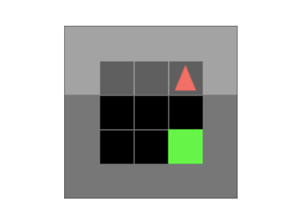
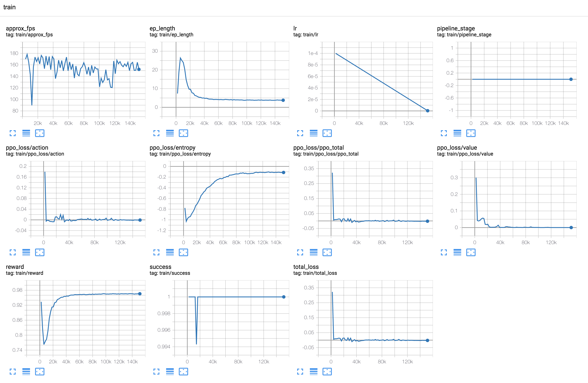
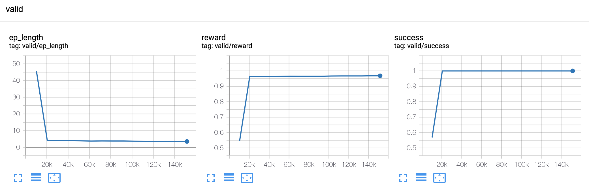
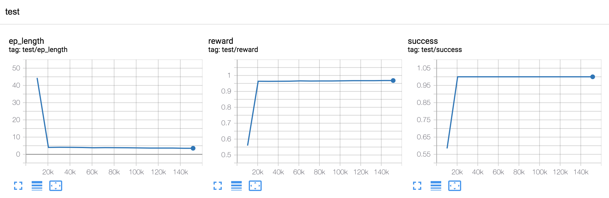

# MiniGrid tutorial
 
This tutorial assumes the [installation instructions](/README.md#installation) have already been followed and, to some
extent, the `embodied-ai` framework's [abstractions](/overview/abstractions.md) are known.
 
# The task
A MiniGrid-Empty-Random-5x5 task consists of a grid of dimensions 5x5 where an agent spawned at a random
location and orientation has to navigate to the visitable bottom right corner cell of the grid by sequences of three
possible actions (rotate left/right and move forward). A visualization of the environment for expert steps in a random
MiniGrid-Empty-Random-5x5 task looks like



The observation for the agent is a subset of the entire grid, simulating a simplified limited field of view, as
depicted by the highlighted rectangle (observed subset of the grid) around the agent (red arrow). Gray cells correspond
to walls.

# Experiment configuration file

Our complete experiment consists of:
- Training a basic actor-critic agent with memory to solve the navigation task.
- Validation on a small set of tasks (running in parallel with training).
- A second stage where we test saved checkpoints with a larger set of tasks.

The entire configuration for the experiment, including training, validation, and testing, is encapsulated in a single 
class implementing the `ExperimentConfig` abstraction. For this tutorial, we will follow the config under
[projects/tutorials/minigrid_tutorial.py](./minigrid_tutorial.py). 

The `ExperimentConfig` abstraction is used by the
[OnPolicyTrainer](/onpolicy_sync/light_engine/#onpolicytrainer) class (for training) and the
[OnPolicyInference](/onpolicy_sync/light_engine/#onpolicyinference) class (for validation and testing)
invoked through the entry script `ddmain.py`. It includes:
- A `tag` method to identify the experiment.
- A `create_model` method to instantiate actor-critic models.
- A `make_sampler_fn` method to instantiate task samplers.
- Three `{train,valid,test}_task_sampler_args` methods describing initialization parameters for task samplers used in
training, validation, and testing; including assignment of workers to devices for simulation.
- A `machine_params` method with configuration parameters that will be used for training, validation, and testing.
- A `training_pipeline` method describing a possibly multi-staged training pipeline with different types of losses,
an optimizer, and other parameters like learning rates, batch sizes, etc.

## Preliminaries

We first identify the experiment through a `tag`.  

```python
class MiniGridTutorialExperimentConfig(ExperimentConfig):
    @classmethod
    def tag(cls) -> str:
        return "MiniGridTutorial"
```

## Sensors and Model

A readily available Sensor type for MiniGrid,
[EgocentricMiniGridSensor](/api/extensions/rl_minigrid/minigrid_sensors/#egocentricminigridsensor),
allows us to extract observations in a format consumable by an `ActorCriticModel` agent:

```python
    SENSORS = [
        EgocentricMiniGridSensor(agent_view_size=10, view_channels=3),
    ]
```

The three `view_channels` include objects, colors and states corresponding to a partial observation of the environment
as an image tensor, equivalent to that from `ImgObsWrapper` in https://github.com/maximecb/gym-minigrid#wrappers. The
relatively large `agent_view_size` means the view will only be clipped by the environment walls in the forward and
lateral directions with respect to the agent's orientation.

We define our `ActorCriticModel` agent using a lightweight implementation with recurrent memory for MiniGrid
environments, [MiniGridSimpleConvRNN](/api/extensions/rl_minigrid/minigrid_models/#minigridsimpleconvrnn):

```python
    @classmethod
    def create_model(cls, **kwargs) -> nn.Module:
        return MiniGridSimpleConvRNN(
            action_space=gym.spaces.Discrete(len(MiniGridTask.class_action_names())),
            observation_space=SensorSuite(cls.SENSORS).observation_spaces,
            num_objects=cls.SENSORS[0].num_objects,
            num_colors=cls.SENSORS[0].num_colors,
            num_states=cls.SENSORS[0].num_states,
        )
```

## Task samplers

We use an available TaskSampler class for MiniGrid environments that allows to sample both random and deterministic
`MiniGridTasks`, [MiniGridTaskSampler](/api/extensions/rl_minigrid/minigrid_tasks/#minigridtasksampler):

```python
    @classmethod
    def make_sampler_fn(cls, **kwargs) -> TaskSampler:
        return MiniGridTaskSampler(**kwargs)
```

In order to define the task samplers' arguments for `train`, `valid` and `test`:

```python
    def train_task_sampler_args(
        self,
        process_ind: int,
        total_processes: int,
        devices: Optional[List[int]] = None,
        seeds: Optional[List[int]] = None,
        deterministic_cudnn: bool = False,
    ) -> Dict[str, Any]:
        return self._get_sampler_args(process_ind=process_ind, mode="train")

    def valid_task_sampler_args(
        self,
        process_ind: int,
        total_processes: int,
        devices: Optional[List[int]] = None,
        seeds: Optional[List[int]] = None,
        deterministic_cudnn: bool = False,
    ) -> Dict[str, Any]:
        return self._get_sampler_args(process_ind=process_ind, mode="valid")

    def test_task_sampler_args(
        self,
        process_ind: int,
        total_processes: int,
        devices: Optional[List[int]] = None,
        seeds: Optional[List[int]] = None,
        deterministic_cudnn: bool = False,
    ) -> Dict[str, Any]:
        return self._get_sampler_args(process_ind=process_ind, mode="test")
```

where, for convenience, we have defined a `_get_sampler_args` method:

```python
    def _get_sampler_args(self, process_ind: int, mode: str) -> Dict[str, Any]:
        num_eval_tasks_per_sampler = 5 if mode == "valid" else 10
        return dict(
            env_class=self.make_env,
            sensors=self.SENSORS,
            env_info=dict(),
            max_tasks=None if mode == "train" else num_eval_tasks_per_sampler,
            deterministic_sampling=False if mode == "train" else True,
            task_seeds_list=None
            if mode == "train"
            else list(
                range(
                    process_ind * num_eval_tasks_per_sampler,
                    (process_ind + 1) * num_eval_tasks_per_sampler,
                )
            ),
        )
    
    @staticmethod
    def make_env(*args, **kwargs):
        return EmptyRandomEnv5x5()
```

Note that the `env_class` argument to the Task Sampler is the one determining which task type we are going to train the
model for (in this case, `MiniGrid-Empty-Random-5x5-v0` from https://github.com/maximecb/gym-minigrid#empty-environment)
. For training, we opt for a default random sampling, whereas for validation and test we define fixed sets of randomly
sampled tasks without needing to explicitly define a dataset.

In this toy example, the maximum number of different episodes is 32. For validation we sample 80 episodes, and 160 for
testing, so we can be fairly sure that all possible episodes are visited at least once during evaluation.

## Machine parameters

Given the simplicity of the task and model, we can quickly train the model on the CPU:

```python
    @classmethod
    def machine_params(cls, mode="train", **kwargs) -> Dict[str, Any]:
        return {
            "nprocesses": 128 if mode == "train" else 16,
            "gpu_ids": [],
        }
```

We allocate a larger number of samplers for training (128) than for validation or testing (16), and we default to CPU
usage by returning an empty list of `gpu_ids`.

## Training pipeline

The last definition required before starting to train is a training pipeline. In this case, we just use a single PPO
stage with linearly decaying learning rate:

```python
    @classmethod
    def training_pipeline(cls, **kwargs) -> TrainingPipeline:
        ppo_steps = int(150000)
        return TrainingPipeline(
            named_losses=dict(ppo_loss=Builder(PPO, kwargs={}, default=PPOConfig,)),
            pipeline_stages=[
                PipelineStage(loss_names=["ppo_loss"], max_stage_steps=ppo_steps)
            ],
            optimizer_builder=Builder(optim.Adam, dict(lr=1e-4)),
            num_mini_batch=4,
            update_repeats=3,
            max_grad_norm=0.5,
            num_steps=16,
            gamma=0.99,
            use_gae=True,
            gae_lambda=0.95,
            advance_scene_rollout_period=None,
            save_interval=10000,
            metric_accumulate_interval=1,
            lr_scheduler_builder=Builder(
                LambdaLR, {"lr_lambda": LinearDecay(steps=ppo_steps)}
            ),
        )
```

You can see that we use a `Builder` class to postpone the construction of some of the elements, like the optimizer,
for which the model weights need to be known.

# Training

We have a complete implementation of this experiment's configuration class in
[projects/tutorials/minigrid_tutorial.py](./minigrid_tutorial.py).
To start training from scratch, we just need to invoke

```bash
python ddmain.py minigrid_tutorial -b projects/tutorials -m 1 -o /PATH/TO/minigrid_output -s 12345 \
&> /PATH/TO/log_minigrid_experiment &

tail -f /PATH/TO/log_minigrid_experiment
```

from the project root folder.
- With `-b projects/tutorials` we set the base folder to search for the `minigrid_tutorial` experiment configuration.
- With `-m 1` we constrain the number of subprocesses to 1 (i.e. all task samplers will run in a single process).
- With `-o /PATH/TO/minigrid_output` we set the output folder.
- With `-s 12345` we set the random seed.

If we have Tensorboard installed, we can track progress with
```bash
tensorboard --logdir /PATH/TO/minigrid_output
```
which will default to the URL http://localhost:6006/.

After 150,000 steps, the script will terminate and several checkpoints will be saved in the output folder.
The training curves should look similar to:



If everything went well, the `valid` success rate should converge to 1 and the mean episode length to a value below 4.
(For perfectly uniform sampling, the expectation for the optimal policy is 3.75 steps.) In the not-so-unlikely event of
the run failing to converge to the optimal policy, we can just try to re-run (for example with a different random seed).
The validation curves should look similar to:



# Testing

The training start date for the experiment, in `YYYY-MM-DD_HH-MM-SS` format, is used as the name of one of the
subfolders in the path to the checkpoints, saved under the output folder.
In order to test for a specific experiment, we need to pass its training start date with the option
`-t EXPERIMENT_DATE`:

```bash
python ddmain.py minigrid_tutorial -b projects/tutorials -m 1 -o /PATH/TO/minigrid_output -s 12345 \
-t EXPERIMENT_DATE &> /PATH/TO/log_minigrid_test &

tail -f /PATH/TO/log_minigrid_test
```

Again, if everything went well, the `test` success rate should converge to 1 and the mean episode length to a value
below 4. Detailed results are saved under a `metrics` subfolder in the output folder.
The test curves should look similar to:


